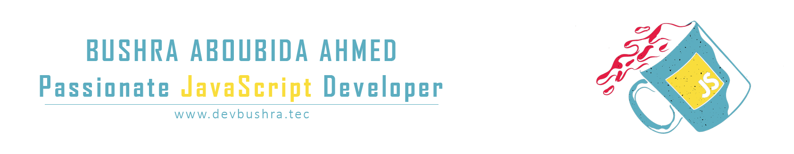

<!-- Main Image -->

<!-- Hello -->
<h1>Hi there I'm Bushra</h1>
I'm a junior javaScript developer, who worked with trending technologies and tools of JavaScript. Developed, and deployed Web and mobile application systems through the entire Software Development Life Cycle (SDLC), using MERN stack. Understanding and implementing concepts like Object-Oriented Programming, Functional Programming, Design Patterns, RESTful Services, Agile Methodologies, and UI/UX Design.  

## 🙋‍♂️ About Me
- 🚀 **Skills:** Web Development, Requirement Analysis, RESTful APIs, Agile Methodologies, Design Patterns, Troubleshooting. 
- ⚡ **Languages:** JavaScript ES6, Node.js,Typescript.
- ⚡ **Web:** HTML, CSS, Bootstrap, Tailwind, JSON, SPA, EJS, AJAX, Redux.
- ⚡ **Frameworks:** Vue.js, Expess.js, Mongoose.
- ⚡ **Libraries:** React, React-Native.
- ⚡ **Test / Debugger Tools:** Mocha, Redux devtools.
- ⚡ **Web Services:** RESTful, JSON, REST.
- ⚡ **Databases:** MongoDB, MySQL.
- ⚡ **Tools:** Visual Studio Code, Collaborative Git, Postman.
- ⚡ **Design Patterns:** Rest, MVC, Module, Prototype, Strategy.
- ⚡ **SDLC:** Agile, Scrum, Waterfall.

## ❤ Languages and Tools:

          

## 📫 Connect with me:

          

## 📊 Views and Followers

